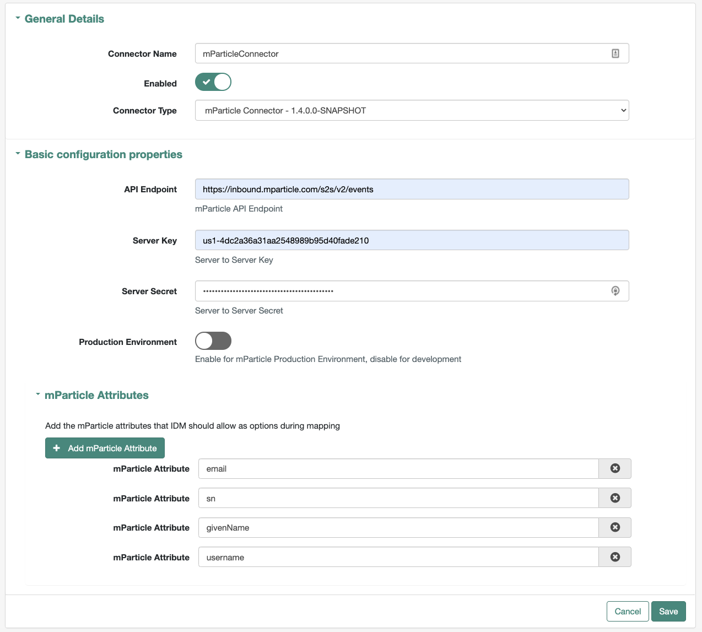
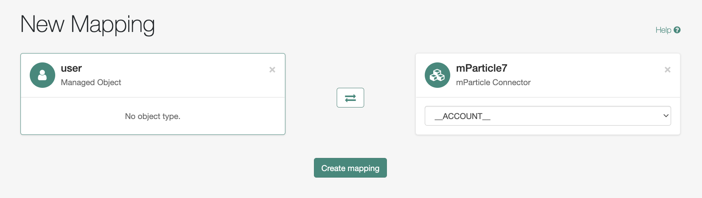
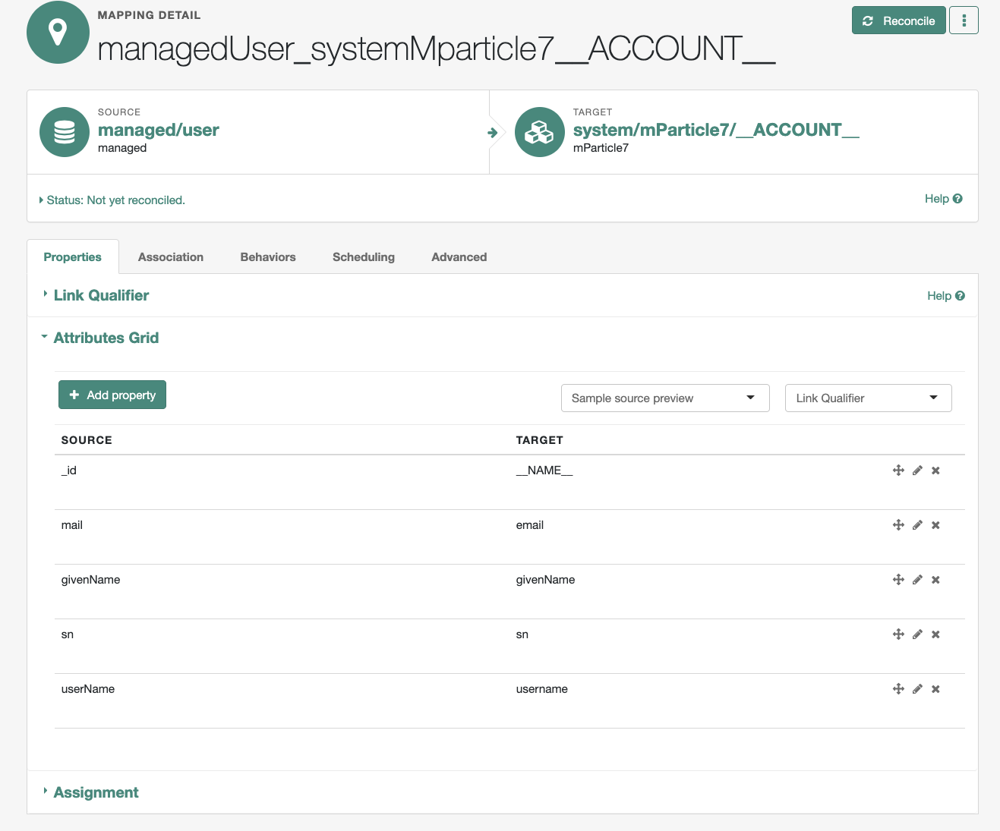
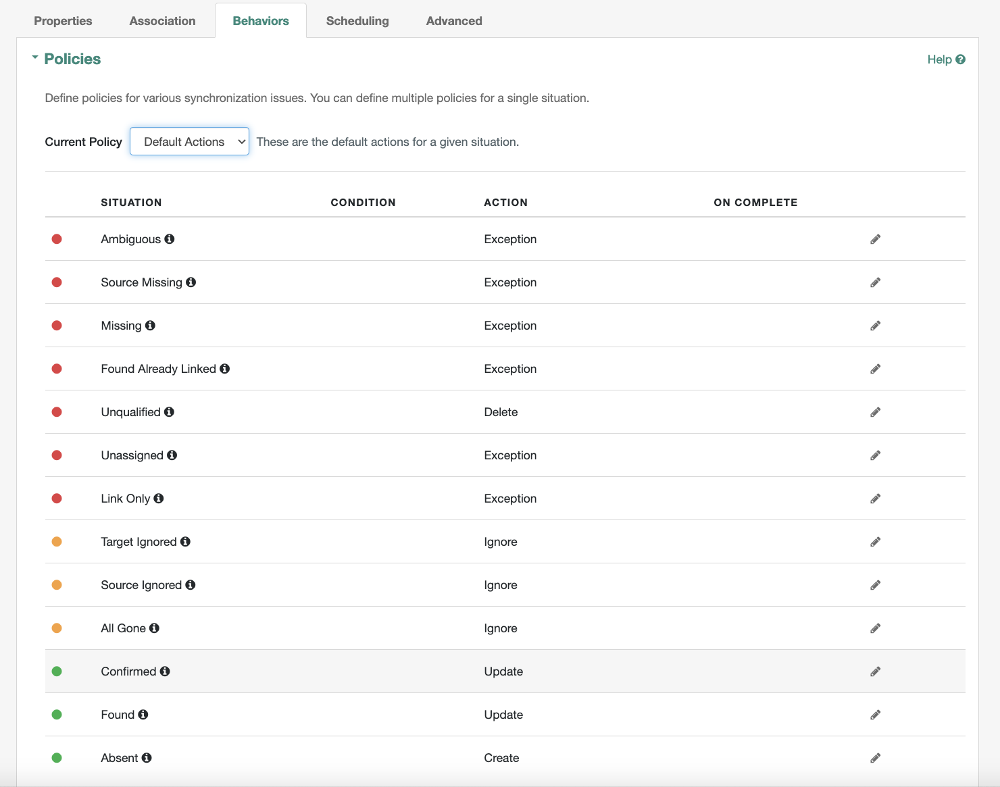

<!--
 * The contents of this file are subject to the terms of the Common Development and
 * Distribution License (the License). You may not use this file except in compliance with the
 * License.
 *
 * You can obtain a copy of the License at legal/CDDLv1.0.txt. See the License for the
 * specific language governing permission and limitations under the License.
 *
 * When distributing Covered Software, include this CDDL Header Notice in each file and include
 * the License file at legal/CDDLv1.0.txt. If applicable, add the following below the CDDL
 * Header, with the fields enclosed by brackets [] replaced by your own identifying
 * information: "Portions copyright [year] [name of copyright owner]".
 *
 * Copyright 2019 ForgeRock AS.
-->
# mParticle Identity Connector

The mParticle Connector lets administrators integrate the mParticle events API into the user registration and
 update process. This connector is compatible with IDM 7.0. 
## Usage

To deploy this connector:
1. Download or build the mParticle Connector jar
2. Next, copy the jar into the `openidm/connectors` directory
3. Copy the `translation.json` to `openidm/ui/admin/default/locales/en/translation.json` (make sure to update
 translation.json with any previous changes you've made for your deployment)
4. Finally, copy `org.forgerock.openicf.connectors.mParticle.mParticleConnector_1.5.html` to `openidm/ui/admin/default/templates/admin/connector/`

### mParticle Connector Configuration

* **API Endpoint** - mParticle API Events API endpoint i.e.`https://inbound.mparticle.com/s2s/v2/events`
* **Server Key** - The mParticle Server to Server Key.
* **Server Secret** - The mParticle Server to Server Secret.
* **Production Environment** - Enable for mParticle Production Environment, disable for development.
* **mParticle Attributes** - Add the mParticle attributes that IDM should allow as options during mapping.
 
 
 
 
 ### Configure Mappings
 
 Once the mParticle Connector has been created, the next step is to define a mapping so that when a user is created
  or updated, IDM calls the mParticle events API.
  1. Create a new mapping which maps the IDM user managed object to the mParticle Connector Account Object: 
  
  
  2. Next, define the attributes that you'd like to map from IDM users to mParticle. The target attributes list is
   generated from the **mParticle Attributes** connector configuration that was defined during connector setup.
   
  3. Finally, configure the Polices for the various synchronization actives. If you select the `Default Actions`
  policy, IDM will call mParticle events for Create and Update operations.
  
  
 ### Example Payload
 When the mParticle connector is configured, and a user gets created in IDM, the following payload is sent from IDM to
 the mParticle events API.
  

  ```
{
  "environment": "development",
  "user_identities": {
    "customer_id": "df4b0850-34cd-42af-85ee-839e69b6899a",
    "email": "user@gmail.com"
  },
  "user_attributes": {
    "forgeRock_givenName": "first",
    "forgeRock_username": "user",
    "forgeRock_sn": "last"
  },
  "events": [
    {
      "event_type": "custom_event",
      "data": {
        "custom_event_type": "user_preference",
        "event_name": "registration"
      }
    }
  ]
}
```

 ## Notes
 1. Make sure the `mainTrustStore` located in `openidm/conf/secrets.json` contains the cacert for `inbound.mparticle.com`.
  If it doesn't, SSL exceptions will occur when the request to mParticle is executed.